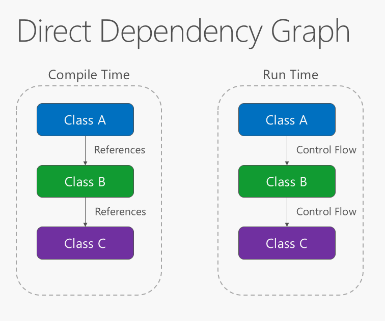
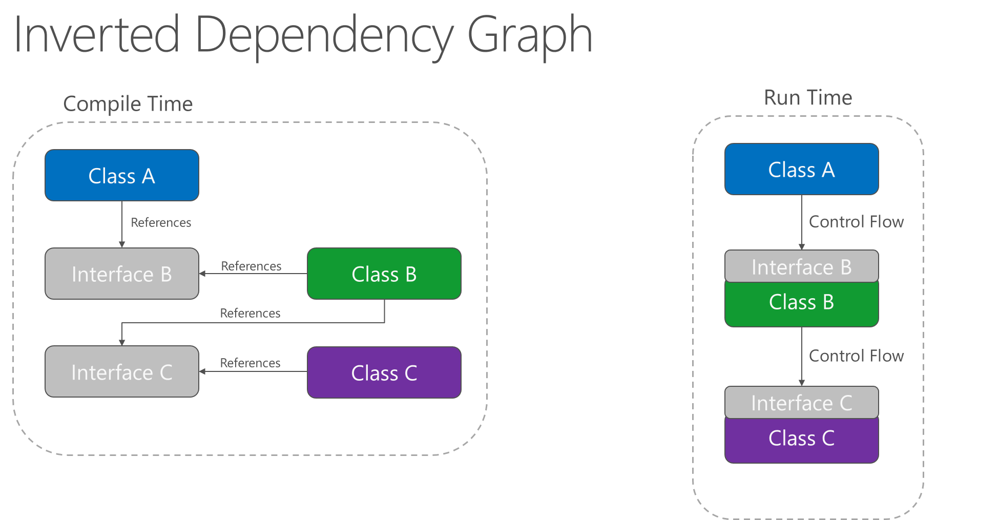

## Concept of Inversion of Control (IoC) / Dependency inversion

Inversion of Control (IoC - Đảo ngược điều khiển) là một nguyên lý thiết kế trong công nghệ phần mềm trong đó các thành phần nó dựa vào để làm việc bị đảo ngược quyền điều khiển khi so sánh với lập trình hướng thủ thục truyền thống.

Khi áp dụng cho các đối tượng lớp (dịch vụ) có thể gọi nó là Dependency inversion (đảo ngược phụ thuộc), để diễn giải trước tiên cần nắm rõ khái niệm Dependency (phụ thuộc)

```
dependency : Giả sử bạn có một lớp classA, lớp này có sử dụng một chức năng từ đối tượng lớp classB (classA hoạt động dựa vào classB). Lúc đó classB gọi là phụ thuộc (dependency) (của classA)
```

### Direct dependency

Có lớp class A có sử dụng một chức năng (gọi hàm ào đó) của class B, lớp class B lại tham chiếu và gọi các chức năng có trong class C. Ta thấy class A dựa vào class B để hoạt động, class B dựa vào class C. Nếu vậy khi thiết kế theo cách thông thường, viết code thì class A có tham chiếu trực tiếp (cứng) đến class B và trong class B có tham chiếu đến class C.

Sự phụ thuộc đối tượng này vào đối tượng khác ở thời điểm viết code và thời điểm thực thi là hoàn toàn giống nhau.



### Inverted dependency

Theo kiến trúc này, ở thời điểm thực thi thì class A vẫn gọi được hàm có class B, class B vẫn gọi hàm có class C nghĩa là kết quả không đổi. Tuy nhiên, khi thiết kế ở thời điểm viết code (trong code) class A không tham chiếu trực tiếp đến class B mà nó lại sử dụng interface (hoặc lớp abstruct) mà classB triển khai. Điều này dẫn tới sự phụ thuộc lỏng lẻo giữa classA và classB.

Khi thực thi, classB có thể được thay thế bởi bất kỳ lớp nào triển khai từ giao điện interface B, classB cụ thể mà classA sử dụng được quyết định và điểu khiển bởi interface B (điều này có nghĩa tại sao gọi là đảo ngược phụ thuộc)



## Dependency injection (DI)

Dependency injection (DI) là một kỹ thuật trong lập trình, nó là một hình thức cụ thể của Inverse of Control (Dependency Inverse) đã nói ở trên. DI thiết kế sao cho các dependency (phụ thuộc) của một đối tượng CÓ THỂ được đưa vào, tiêm vào đối tượng đó (injection) khi nó cần tới (khi đối tượng khởi tạo). Cụ thể cần làm:

- Xây dựng các lớp (dịch vụ) có sự phụ thuộc nhau một cách lỏng lẻo, và dependency có thể tiêm vào đối tượng (injection) - thường qua phương thức khởi tạo constructor, property, setter
- Xây dựng được một thư viện có thể tự động tạo ra các đối tượng, các dependency tiêm vào đối tượng đó, thường là áp dụng kỹ thuật Reflection của C# (xem thêm lớp type): Thường là thư viện này quá phức tạp để tự phát triển nên có thể sử dụng các thư viện có sẵn như: Microsoft.Extensions.DependencyInjection hoặc thư viện bên thứ ba như Windsor, Unity Ninject ...

Code mà các dependency có thể đưa vào từ bên ngoài (chủ yếu qua phương thức khởi tạo), giúp cho các dịch vụ tương đối độc lập nhau. Nó là cơ sở để có thể dùng các Framework hỗ trợ DI (tự động phân tích tạo dịch vụ, dependency)

#### Example:

Giả sử có lớp Car có chức năng (phương thức) Beep() - để phát ra tiếng còi xe, mà để phát ra tiếng còi - nó lại dựa vào vào lớp Horn chuyên tạo ra tiếng còi - lúc đó ta nói lớp Car có một phụ thuộc (dependency Horn) là lớp Horn, Horn là dependency của Car.

Muốn lớp Car hoạt động thì nó phải có đối tượng (dịch vụ) từ Horn. Vậy khi thiết kế, thường có hai cách:

- Trong lớp Car thiết kế code mà nó phụ thuộc cứng vào lớp Horn - tự khởi tạo Horn, cách thiết kế này không có khả năng áp dụng kỹ thuật DI
- Trong lớp Car, dependency Horn không do Car trực tiếp khởi tạo mà nó được đưa vào qua phương thức khởi tạo, qua setter, qua gán property. Các thiết kế này linh hoạt và có KHẢ NĂNG để áp dụng DI

## Types of Dependency Injection

Từ cách thức một dependency được đưa vào đối tường cần nó thì được phân chia có ba kiểu DI:

- Inject thông qua phương thức khởi tạo: cung cấp các Dependency cho đối tượng thông qua hàm khởi tạo (như đã thực hiện ở ví dụ trên) - tập trung vào cách này vì thư viện .NET hỗ trợ sẵn
- Inject thông qua setter: tức các Dependency như là thuộc tính của lớp, sau đó inject bằng gán thuộc tính cho Depedency object.denpendency = obj;
- Inject thông qua các Interface - xây dựng Interface có chứa các phương thức Setter để thiết lập dependency, interface này sử dụng bởi các lớp triển khai, lớp triển khai phải định nghĩa các setter quy định trong interface

```
Trong ba kiểu Inject thì Inject qua phương thức khởi tạo rất phổ biến vì tính linh hoạt, mềm dẻo, dễ xây dựng thư viện DI...
```

Toàn bộ phần trên là lý thuyết cơ bản, triển khai thực tế thì cần có một dịch vụ trung tâm gọi là DI Container, tại đó các lớp (dịch vụ) đăng ký vào, sau đó khi sư dụng dịch vụ nào nó tự động tạo ra dịch vụ đó, nếu dịch vụ đó cần dependency nào nó cũng tự tạo dependency và tự động bơm vào dịch vụ cho chung ta. Để tự xây dựng ra một DI Container rất phức tạp, nên ở đây ta không cố gắng xây dựng một DI Container riêng, thay vào đó ta sẽ sử dụng các thư viện hỗ trợ sẵn cho .NET.
