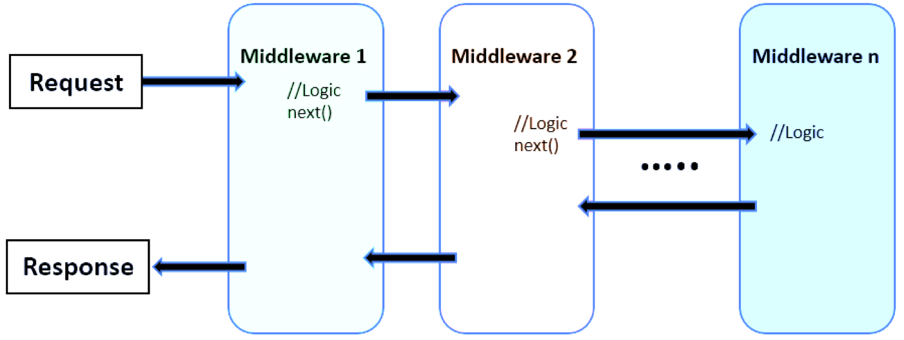

## Introduction about MiddleWare / Pipeline

### MiddleWare

Một Middleware là một module code nó nhận yêu cầu gửi đến Request và trả về Response. Cụ thể trong ASP.NET Core, middlewarre có thể:

- Nhận một HTTP Request gửi đến và phát sinh ra HTTP Response để trả về
- Nhận một HTTP Request gửi đến, thi hành một số tác vụ (có thể là sửa đổi HTTP Request), sau đó chuyển đến một middleware khác.
- Nhận HTTP Response, sửa nó và chuyển đến một Middleware khác

### Pineline

Trong ứng dụng ASP.NET Core, các middlware kết nối lại với nhau thành một xích, middleware đầu tiên nhận HTTP Request, xử lý nó và có thể chuyển cho middleware tiếp theo hoặc trả về ngay HTTP Response. Chuỗi các middleware theo thứ tự như vậy gọi là pipeline.

Các middleware như là các dịch vụ nhỏ, đăng ký vào ứng dụng bằng cách sử dụng đối tượng IApplicationBuilder, sau đó ứng dụng sẽ xây dựng lên các pipeline (luồng xử lý) cho các truy vấn gửi đến.



Trong ứng dụng ASP.NET CORE, có sẵn một một loạt Middleware hoặc có thể xây dựng thêm để đưa vào một pipeline, luồng xử lý HttpRequest và trả về HttpResponse. Việc thêm Middleware vào pipeline được thực hiện ở phương thức Configure của lớp Startup. Các middleware trong pipeline xử lý các HTTP Message đều có dạng - nhận đầu vào là tham số kiểu HttpContext (có chứa HttpRequest và HttpRespone), thi hành code, sau đó chuyển đến cho middleware tiếp theo.

## Create custom Middleware

### Cấu trúc Middleware trong ASP.NET

Một lớp (class) phù hợp là một Middleware trong ASP.NET nếu lớp đó có cấu trúc thỏa mãn những điều kiện sau:

- Có một phương thức khởi tạo public (hàm tạo) với tham số thứ nhất kiểu RequestDelegate, nếu có tham số thứ 2 thì các tham số tiếp theo này phải Inject được từ DI của hệ thống
- Phải có tổi thiểu một trong hai phương thức có tên Invoke hoặc InvokeAsync với tham số nhận là HttpContext, những phương thức này phải trả về Task. (Dùng InvokeAsync nếu muốn áp dụng kỹ thuật bất đồng bộ - nên làm)
- Trong Invoke/InvokeAsync bạn viết code xử lý tác vụ của Middleware, sau đó quyết định chuyển đến Middleware tiếp theo bằng cách gọi RequestDeleage đã truyền đến trong hàm tạo, hoặc không chuyến đến Middlware tiếp theo thì cần đảm bảo lúc này HttpResponse trrong HttpContext đã phù hợp để trả về cho Client.

### Đưa Middleware vào pipeline

Như vậy đã có một Middleware theo đúng chuẩn để có thể đưa vào pipeline nhận HttpRequest của ASP.NET Core. Để đăng ký chỉ việc sử dụng phương thức UseMiddleware của IApplicationBuilder

Ví dụ, tại phương thức Configure của Startup

```csharp
public void Configure(IApplicationBuilder app, IHostingEnvironment env)
{
    / ..
    app.UseStaticFiles();
    app.UseSession();
    // Đưa Middleware vào pipeline - vị trí thứ 3
    app.UseMiddleware<CheckAcessMiddleware>();
    /..
}
```

Tuy nhiên ta sẽ làm theo cách các Middleware mặc định được đăng ký, tức là thêm phương thức mở rộng vào IApplicationBuilder, ví dụ thêm vào nó phương thức UseCheckAccess

```csharp
using Microsoft.AspNetCore.Builder;

namespace _02.middleware
{
    public static class MyAppExtensions
    {
        // Mở rộng cho IApplicationBuilder phương thức UseCheckAccess
         public static IApplicationBuilder UseCheckAccess(this IApplicationBuilder builder)
         {
             return builder.UseMiddleware<CheckAcessMiddleware>();
         }
    }
}
```

Đã có phương thức mở rộng UseCheckAccess, để đăng ký Middleware vào pipeline thực hiện

```csharp
public void Configure(IApplicationBuilder app, IHostingEnvironment env)
{
    / ..
    app.UseStaticFiles();                       // Đưa Middleware vào pipeline - vị trí đầu tiên
    app.UseSession();                           // Đưa Middleware vào pipeline - vị trí thứ 2

    app.UseCheckAccess();                      // Đưa Middleware vào pipeline - vị trí thứ 3
    /..
}
```

## Xây dựng Middleware triển khai từ giao diện IMiddleware

Bạn có thể triển khai giao diện IMiddleware, trong đó chỉ việc xây dựng phương thức

```csharp
Task InvokeAsync(HttpContext context, RequestDelegate next)
```

Ví dụ, xây dựng một Middleware - đặt tên FrontMiddleware, Middleware này không làm gì cả, nó chỉ in ra console thông báo cho biết Request đã đi qua nó - ta sẽ đặt Middleware này ở đầu pipeline, sau đó chuyển đến Middleware tiếp theo trong pipeline.

```csharp
using System;
using System.Collections.Generic;
using System.Linq;
using System.Threading.Tasks;
using Microsoft.AspNetCore.Hosting;
using Microsoft.AspNetCore.Http;
using Microsoft.Extensions.Configuration;
using Microsoft.Extensions.Hosting;
using Microsoft.Extensions.Logging;

namespace _02.middleware {
  public class FrontMiddleware : IMiddleware
  {
    public async Task InvokeAsync(HttpContext context, RequestDelegate next)
    {
        Console.Clear();
        Console.WriteLine("FrontMiddleware: " + context.Request.Path);
        await next(context);
    }
  }
}
```

Đối với loại Middleware này để sử dụng nó, phải đăng ký vào DI container trước (đăng ký dịch vụ) trong phươnng thức ConfigureServices của Startup

```csharp
public void ConfigureServices(IServiceCollection services)
{
    services.AddTransient<FrontMiddleware>();
    //.. các đăng ký khác
}
```

Sau đó thêm vào pipeline theo cách thông thường, khai báo đầu tiên trong Configure để nó đứng đầu pipeline

```csharp
public void Configure(IApplicationBuilder app, IWebHostEnvironment env)
{
    app.UseMiddleware<FrontMiddleware>();
    // ... các Middleware khác
}
```

## Truyền dữ liệu giữa các Middleware

Để truyền dữ liệu giữa các Middleware hãy sử dụng HttpContext.Items, nó là dữ liệu kiểu IDictionary, có thể lưu dữ liệu vào trong nó ở Middleware này và ở Middleware khác đọc được.

Lưu dữ liệu:

```csharp
context.Items.Add("dulieu1", "Data Object ...");
```

Đọc dữ liệu:

```csharp
var data  = context.Items["dulieu1"];
```
